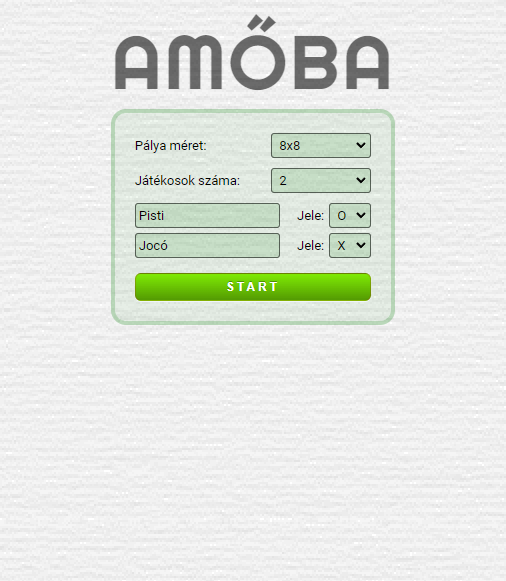

# AMŐBA

Amőba játék
Készítette: [Márton László Attila](https://github.com/marton-laszlo-attila)

  

## A játékról

A klasszikus amőba játék React-ben elkészítve. Typescript változat.

## Indítás

### Fejlesztési módban futtathatja az alkalmazást:

<pre><code>npm start</code></pre>

Nyissa meg [http://localhost:3000](http://localhost:3000) hogy megtekinthesse a böngészőben.

### Tesztek futtatása

<pre><code>npm run test</code></pre>

## Licenc

MIT License
